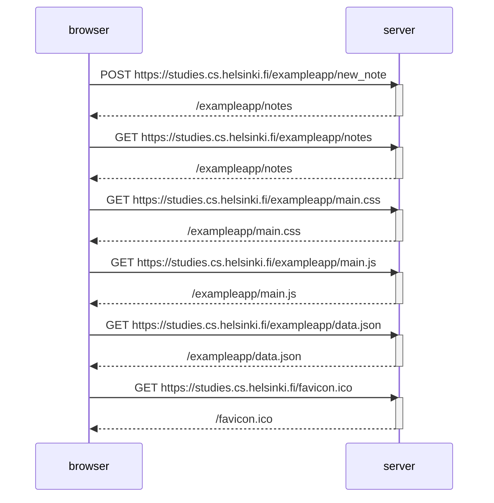

```mermaid
sequenceDiagram
    participant browser
    participant server
    

	browser->>server: POST https://studies.cs.helsinki.fi/exampleapp/new_note
    activate server
    server-->>browser: /exampleapp/notes 
    deactivate server
    
	browser->>server: GET https://studies.cs.helsinki.fi/exampleapp/notes
    activate server
    server-->>browser: /exampleapp/notes 
    deactivate server

    browser->>server: GET https://studies.cs.helsinki.fi/exampleapp/main.css
    activate server
    server-->>browser: /exampleapp/main.css
    deactivate server
    
    browser->>server: GET https://studies.cs.helsinki.fi/exampleapp/main.js
    activate server
    server-->>browser: /exampleapp/main.js
    deactivate server
    
    browser->>server: GET https://studies.cs.helsinki.fi/exampleapp/data.json
    activate server
    server-->>browser: /exampleapp/data.json
    deactivate server    

	browser->>server: GET https://studies.cs.helsinki.fi/favicon.ico
    activate server
    server-->>browser: /favicon.ico
    deactivate server  


```